User's guide
============

Introduction
------------

Brief introduction about the project and why it was important to create a
web app.

* Why Python-Django

  Talk about Python programming language and Python web framework:
  Django. Talk about advantage of using python over other programming languages.

* GIT

  Tell why you used GIT to manage this project. Also talk about other
  version control software.

* GNU/Linux

  Talk about GNU, Linux, and Open source. Also mention other linux
  distros and describe Ubuntu.

Description
-----------

Here you will describe your project's workflow like how the different
sections(Books, Contributor, Reviewer) are divided and why. Basically
you will talk about models buy in layman term. This should be
understood by any non-technical user. This section should consume
about 70% of the user-guide.

Workflow
~~~~~~~~

Describe models(in layman terms)

Interface
~~~~~~~~~

**User Interface**

  User Interface for the "WebPortal" application begins with the homepage of the portal, showing the recent uploads, number of             classes,subjects and uploads. It also have links to the Contact Us, Content, Register(dropdown of contributor/reviewer), Login and more pages which includes a dropdown of the Docs, About us and detail of the users.
Once a person is logged in, the login button changes to his username and a dropdown comes on clicking his username, which can take him to his profile or enable him to logout.

  ``Example:``
*

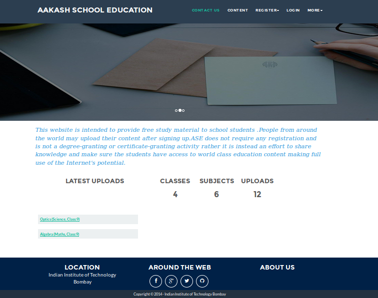

   Home page (without logging in)

*
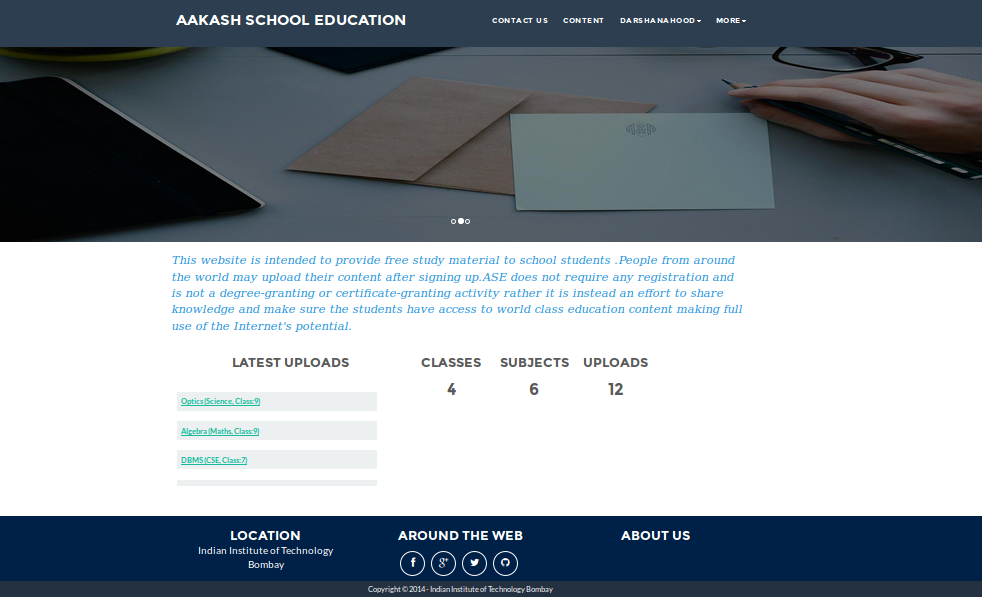

   Home page (after logging in)

**Contact Us**
  
  Clicking on this link redirects a user to a new page with a contact us form using which the user can contact the site administrators.

  ``Example:``

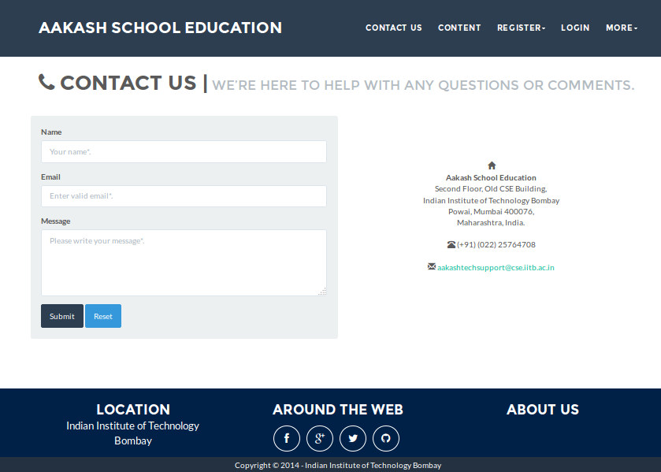

   Contact Us

**About us**
   Clicking on this link will give an overview of our website, regarding the main motive of this website and how will it help the students, and its relation to the Aakash School Education.

  ``Example:``

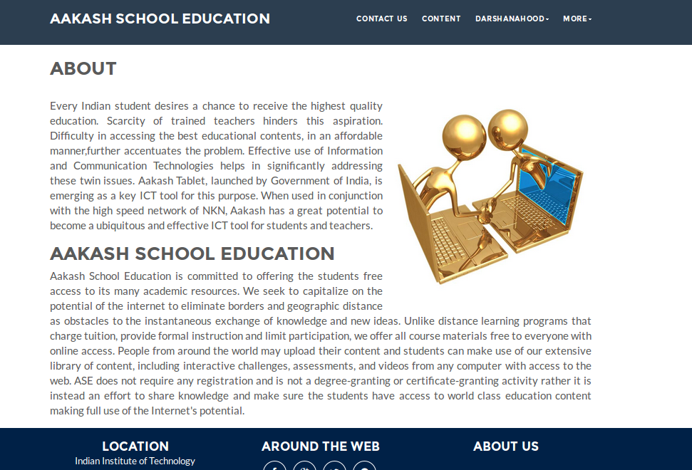

   About Us

**Content**
  
  This section opens on clicking the content button in the homepage. This section is for showing the entire contents which is present in the website. Initially we have to Select a language in which we want to see the content.
  
   ``Example:``

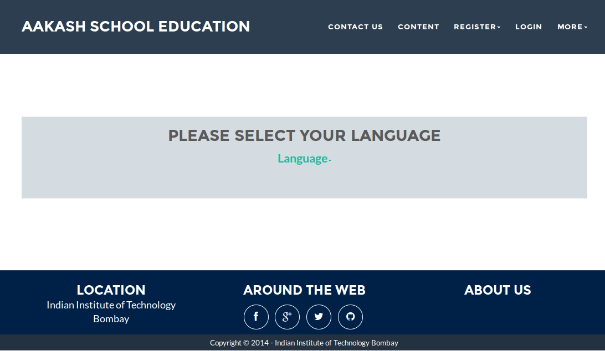

   Select a language 

*Contents corresponding to that language*

  After selecting the language, the contents corresponding to that language will get displayed. It gets displayed in the form of a table with its fields as Class, Subject, Topic, Summary, PDF, Video and Animations present.

    ``Example:``

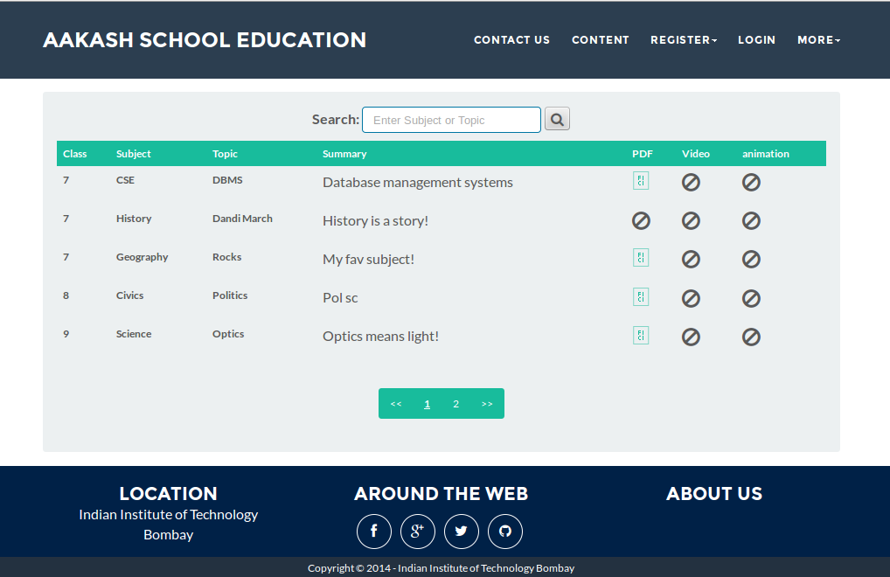

   Contents corresponding to that language

*Search button*

  There is also an option to search in the contents page. The search box provides us an option to enter either the subject or the topic of a subject, to search for. On clicking the search icon, the given string is matched with the available contents and wherever there is a match, the corresponding topics are displayed on the next page. Also there is a button to Go Back to the content's page.

    ``Example:``

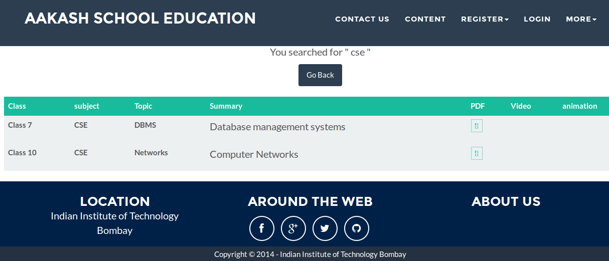

   Search

**Register**

  If a person wants to register in the website, this is the place to go. There are 2 options for registering, i.e. As a contributor or as a reviewer.

*Register as a Contributor*
  This takes us to register in the website as a contributor i.e. the person who is going to upload the documents of various subjects and topics. He has to fill the form displayed in the page, the fields are username, firstname, lastname, email, password, profile picture, contact and the validation files(which checks if the contributor has the required qualification or not). Then he has to click the register button to get himself registered.

    ``Example:``

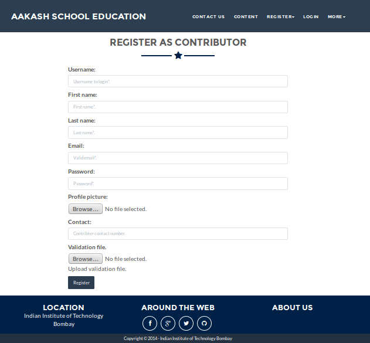

   Register as a contributor

*Register as a Reviewer*
  This takes us to register in the website as a reviewer i.e. the person who is going to review the uploaded documents. He has to fill the form displayed in the page, the fields are username, firstname, lastname, email, password, profile picture and contact. Then he has to click the register button to get himself registered.  

    ``Example:``

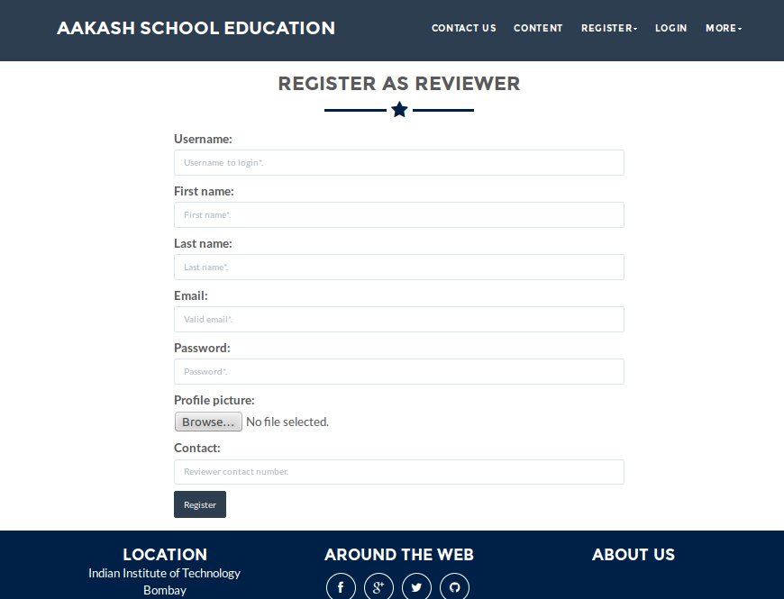

   Register as a reviewer

**Login**
  This field is used for both the contributor and reviewer to Login. The user has to enter his username and password and the click on Sign In to login to his profile. In case his username and password cannot authenticate (by entering wrong password), he will get an error message saying Bad Login.

*Forgot Password*
  This is an option to let the user to retrieve his password in case he forgets it. He has to enter his email through which he registered in the website, and a mail will be sent which would contain his old password. He can then later login and change his password ( discussed later)

    ``Example:``

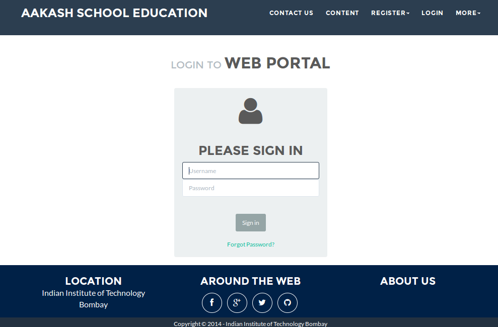

   Login

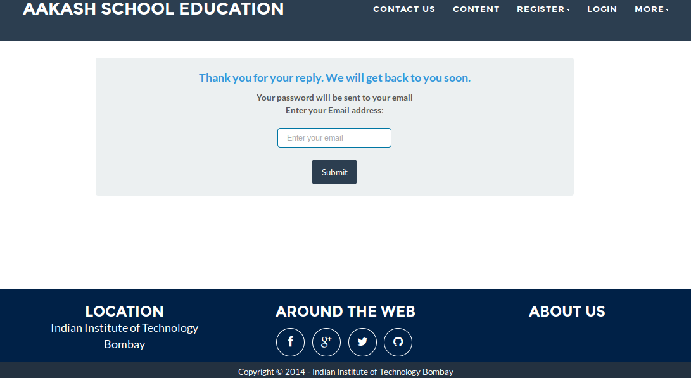

   Forgot Password

**Contributor's Profile**
  After a contributor logs in, it takes him to his profile. Also he sees an "Upload more" button which when clicked takes him to the Upload Section. There are two more buttons i.e. Edit Profile and Change Password. These 3 buttons always remain fixed for the entire time when the contributor is logged in.
The first page he sees after logging in is the List of classes in which documents are uploaded. 

The second page contains the list of subjects under a particular class.

The third page contains the list of topics under a particular subject and its details, such as Summary, PDF, Video and animation.

The fourth page contains the list of comments under a particular topic.

    ``Example:``

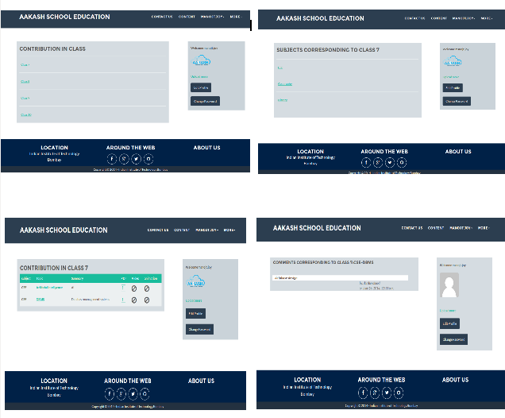
   
   Contributor Profile

*Upload More*
   When a contributor clicks on the upload more button, it takes him to the upload more form which contains various fields such as language, class, Subject name, topic, pdf, video, animation and summary. Once he fills the entire form, he clicks on upload more which uploads the content. If any required field is missing, it raises error. If none of PDF, video or animation is present, it raises an error. Also, there is a limitation of file size of pdf, upon exceeding it raises an error.

    ``Example:``

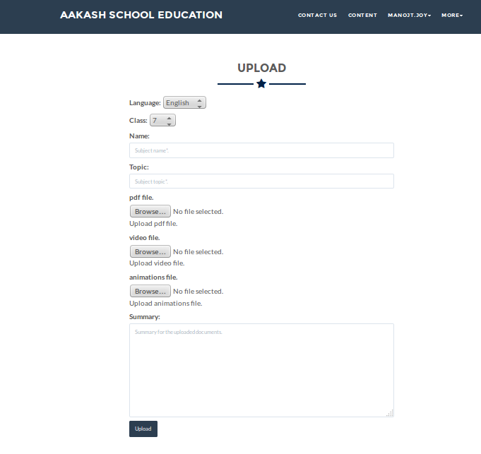
   
   Upload more

**Reviewer's Profile**
   After a reviewer logs in, it takes him to his profile. Also he sees an "Past Approvals" button which when clicked takes him to his recent past approvals. There are two more buttons i.e. Edit Profile and Change Password. These 3 buttons always remain fixed for the entire time when the reviewer is logged in.
The first page he sees after logging in is the list of classes in which documents are uploaded. 

The second page contains the list of subjects under a particular class.

The third page contains the list of topics under a particular subject and its details, such as Summary, PDF, Video and animation.
Also, there is an approve button which the reviewer has to click if he feels that the uploaded documents are suitable for the topic and can be published. If a topic is approved by 3 or more reviewers, it is accepted as Published and it goes into the Content page.

The fourth page contains the list of comments under a particular topic. Also, since the user is a reviewer, he has the freedom to add any number of comments, and view all the previous comments on the topic. Upon commenting, the date, time and username of the reviewer comes beneath the comment.

    ``Example:``

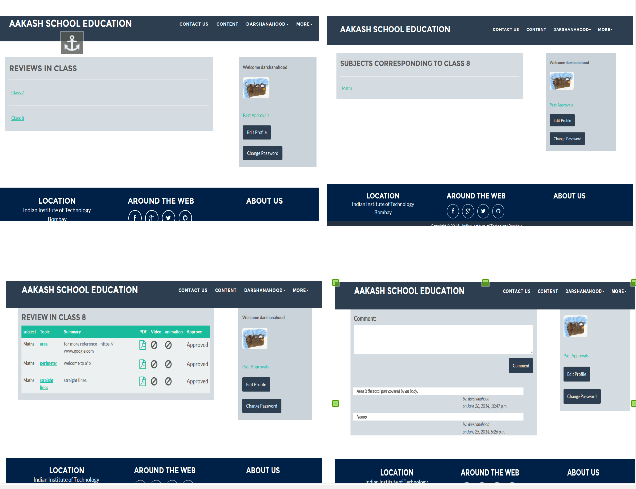
   
   Reviewer Profile

*Past Approvals*
   When a reviewer clicks on the "Past Approval" button, it takes him to the past approval table which contains various fields such as class, Subject name, topic, pdf, video, animation, summary and the Approved status. The content already approved by the reviewer in his profile will be displayed here.

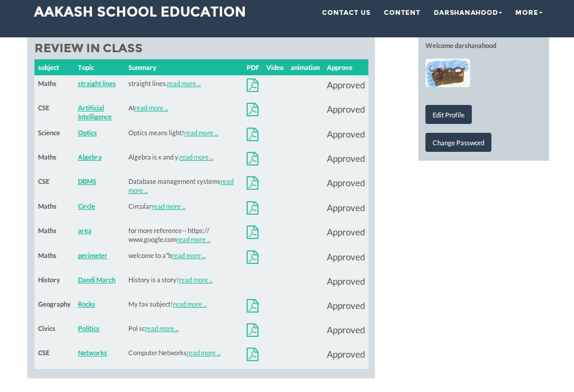
   
   Past Approvals

*  The next two sections are common both for contributor and reviewer

**Edit Profile**
  Upon clicking the edit profile button, the user (contributor or reviewer) gets an oppurtunity to edit his profile. The user form and the contributor/reviewer form is displayed, with an instance of the contributor/reviewer present. So if a user wants to edit anything, he can see his previous information and feed in the new information. The password has to be filled again and then he has to click Save Changes to save the changes.

    ``Example:``

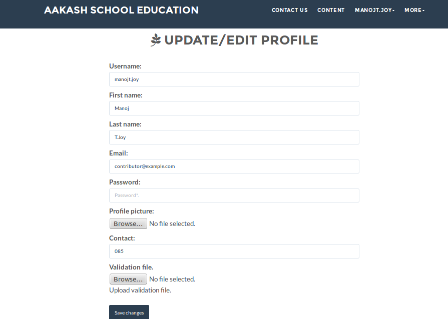
   
   Contributor Edit Profile

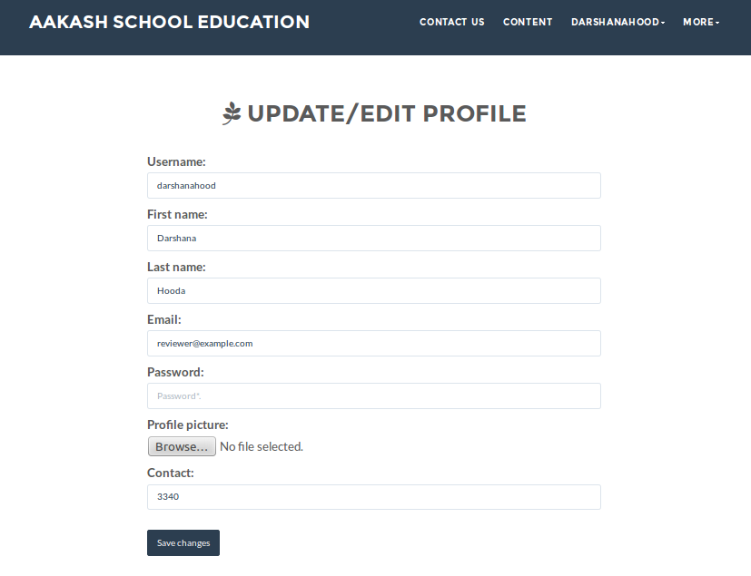
   
   Reviewer Edit Profile

**Change Password**
   Upon clicking this a new page opens up. The user has to enter his old password and if it matches correctly, he is given an option to change his password. He again has to type his new password for confirmation, if both are same, his password is changed and the success message is displayed. Else an error message pops up.

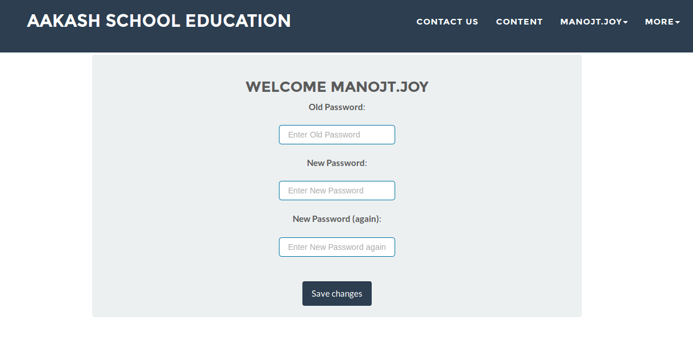
   
   Password Change

